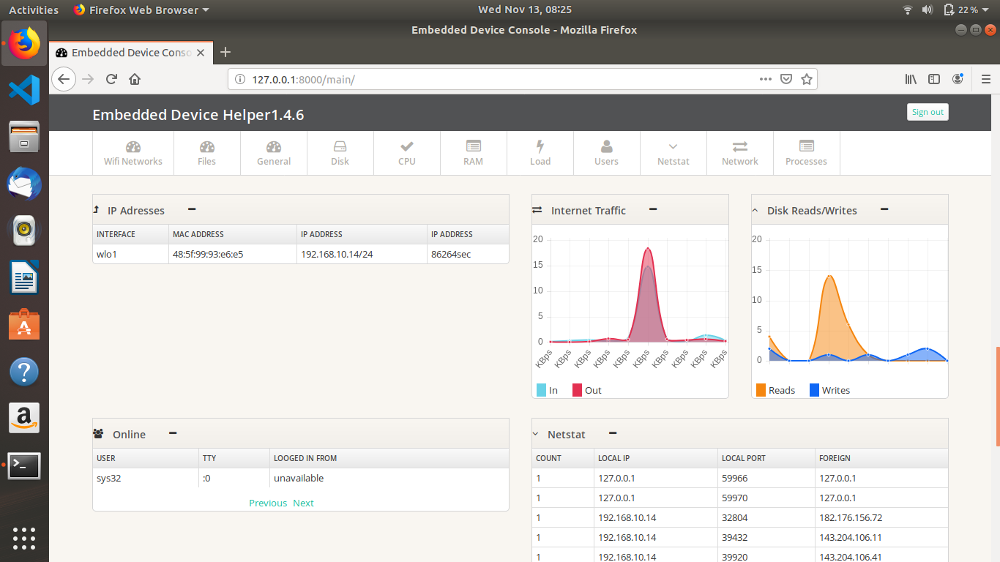

EmbeddedControl - v1.4.6
======
A small web-based monitoring dashboard for your linux pc/server, Connecting to Wifi and Handling files on Linux Server writen in Python and Django + Chart.js.

The dashboard is built using only Python libraries available in the main Python distribution, trying to create a small list of dependencies without the need of installing many packages or libraries.

Current dependencies:

  - >= Django 1.5
  - >= Python 2.x
  - >= Python 3.x

Screenshots
============

Installation
============

1. sudo apt update
2. sudo apt-get install git python-pip apache2 libapache2-mod-wsgi
3. sudo apt-get install python2.7
4. Unzip the Embedded Device Control
5. cd Embedded Device Control
6. sudo pip install -r Requirements.txt
7. cd EmbeddedControl
8. sudo python2 manage.py createsuperuser (Then enter Username and Password)
9. sudo python2 manage.py runserver
and Your Server Would be running in local http://127.0.0.1:8000/ and Login with Credientials set in Step 8

Remote data retrieval
=====================
EmbeddedControl will allow you to retrieve data remotely if needed. This can be useful if you want to store any of the data in a database or another application.

Data is being returned in JSON format and can be easy retrieved and stored as long as a session is being created to EmbeddedControl for login. For session and how-to use sessions please see https://docs.djangoproject.com/en/1.6/topics/http/sessions/ .

EmbeddedControl has a list of short URLs which you can use to retrieve the specific JSON datasets/lists. The URLs are as follows:

/fileUpload/ - File Handling
/info/wifi - Wifi
/info/uptime/ - Uptime
/info/platform/hostname/ - Hostname
/info/platform/osname/ - OS Name
/info/platform/kernel/ - Kernel
/info/getcpus/cpucount/ - Number of CPU cores
/info/getcpus/cputype/ - Type/Name of CPU
/info/memory/ - Memory Usage
/info/cpuusage/ - CPU Usage in percentage(%), free and used
/info/getdisk/ - Disk Usage
/info/getusers/ - Online Users
/info/getips/ - IP Addresses
/info/gettraffic/ - Internet Traffic
/info/getdiskio/ - Disk Reads/Writes
/info/proc/ - Running Processes
/info/loadaverage/ - Load Average
/info/getnetstat/ - Netstat
To see the format of the JSON returned datasets or data you can access any of the URLs from your browser as http://youEmbeddedControlip/url , ex. http://demo.EmbeddedControl.net/info/uptime/ .

OS Support
==========

EmbeddedControl was tested and runs under the following OS's:
  - Centos
  - Fedora
  - Ubuntu
  - Debian
  - Raspbian
  - Pidora
  - Arch Linux

Might work under others, but didn't get to test any other OSs just yet.

Credits
=======
[Dashboard Template](http://www.egrappler.com/templatevamp-free-twitter-bootstrap-admin-template/), 
[Bootstrap](http://getbootstrap.com/), 
[Font Awesome](http://fontawesome.io/)
